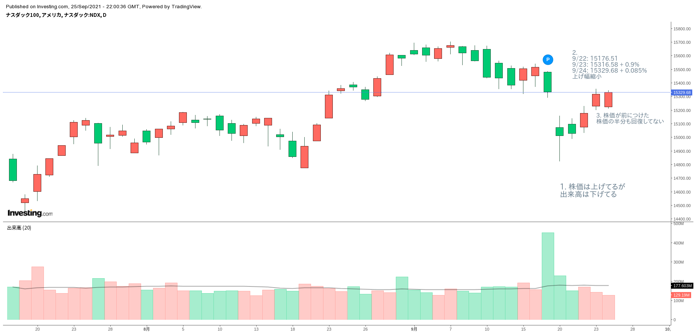

(長すぎて、スペルミスとかあると思うので適当に書き換えてください)

## M = Market Direction: How You Can Determine It

shinseitaro

- Market Direrction （マーケット全体の方向性）を見誤ったらダメ
- 今が
  - bull market(強気相場) なのか
  - bear market(弱気相場) なのか
  - bull もしくは bear の early stage(初期段階) なのか later stage (終盤) なのか
- さらに

  - マーケットの環境が悪くて下げているのか
  - normal intermediate decline なのか（長期的にみて、調整的に起こる、8-12％くらいの下げ）
    見極める必要がある

- マーケットの方向性を見る方法
  - 主要な平均株価を３，４種類、日足で、株価と出来高を見る
  - SP500, Nasdaq, DOW, [NYSE 総合指数](https://www.bloomberg.co.jp/quote/NYA:IND)
  - IBD には、移動平均と「買い集め、売り抜け指数 (Accumulation/Distribution Rating ACC/DIS RTG)」を掲載している
    - 買い集め、売り抜け指数：機関投資家による買い支え、売り抜けがわかる指数。らしい。
- (くわしくは `Three Signs the First Rally Attempt May Fail` 章で解説されてるらしい)

## What Is the General Market?

misato

## Why Is Skilled, Careful Market Observation So Important?

nobolis

## The Stages of a Stock Market Cycle

natsuko

## You Should Study the General Market Indexes Each Day

shinseitaro

- In the bear markets, stocks usually open strong and close weak. In bull markets, they tend to open weak and close strong
  - 弱気相場では株価は寄り付きで強く、引けで下落。強気相場はその逆。
  - （これ、経験的にもよく見る傾向です ⇑）
- マーケット全体が上がりきって踊り場の様子だったら、保有している株の一部を現金化して、信用取引を小さくすべし
- この踊り場を見つけるために株価と出来高をチャートから読み取る分析が必要
- (たぶん、それだけじゃムリで、債権利回りの動きも必須)

## The Prolonged Two-Year Bear Market of 1973-1974

misato

## A 33% Drop Requires a 50% Rise to Break Even

nobolis

## The Myths about "Long-Term Investing" and Being Fully Invested

natsuko

## Protecting Youself from Market Downturns

shinseitaro

- After you see the first several definite indications of a market top, don't wait around.
- 市場が天井を打ったようにみえたら、躊躇せずに保有株を売る
- 株式で保有している 25％以上をキャッシュにする
- 弱気が始まった時は、打って現金化するか、空売りするしかない。
- 空売りは専門的な技術。詳しくは 12 章で。
- 弱気はだいたい 5-6 ヶ月続く

## Using Stop-Loss Orders

misato

## How You Can Learn to Identify Stock Market Tops

nobolis

## After the Initial Decline Off the Top, Track Each Really Attempt on the Way Down

natsuko

## Three Signs the First Rally Attempt May Fail

shinseitaro

- 下落しえいる局面で、反発することがある。
- 上昇しているように見えるけど**ダマシ**である可能性が高い 3 つのサインがある

1. インデックスは３，４，５日目に上昇するが、出来高は前日より少ない状況
1. インデックスの株価の上げ幅が前日よりすくない
1. インデックスの株価が前につけた高値から直近の安値幅の半分も回復していない

- ちなみに 2021/09/26 現在 NASDAQ が全部当てはまってますｗ
  

## How CAN SLIM and IBD Read Flagged the March 2000 Nasdaq Top

misato

## Spotting the 2007 Top in the Market

nobolis

## Historical Tops for Futher Study

natsuko

## Follow the Leasers for Clues to a Market Top

shinseitaro

- 主導株から、マーケット全体の天井を見極める
  - よくある主導株の変な挙動。これらが起きた場合は、マーケット全体に注意する
  1. 主導株が、３，４回目のベースを抜けたあと、値動きがワイドになったり、上昇が弱まったりして、ベースがキチンと形成されない場合。その場合は日足や週足の "faulty base" (wide, loose, erratic) が起きていないか確認する
  1. "climax top" の形成も危ない。（詳しくはChapter11）
  1. 出来高が急増しているのに高値ブレイクできない場合
  1. 出足が遅く、安値で低品質の停滞株（laggerds）が値上がりしてくるような場合も注意
  1. 下降トレンドに入る初期段階に、いくつかの主導株のみ下降トレンドに逆らうかのように上昇しようとすることがある。
 - マーケットの方向転換は、最終警告。 強気相場で天井をつけるタイミングは、主導株などの買いポイントの５〜７ヶ月後に起きがち。１０章１１章で学んだ方法でピークまえに売り抜けよう

## Other Bear Market Warnings

misato

## Don't Jump Back In Too Early

nobolis

## how You Can Stop Stock Market Bottoms

natsuko

## The Big Money Is Made in the First Tow Years

shinseitaro
- 大きく儲けるチャンスは、新しい強気相場が始まって最初の１〜２年
- そのあとは平均株価が上下し始めて、弱気相場が始まる
- 弱気相場の始まりの特徴
  - 弱気相場の最初の１，２年は、平均株価に中期的な下落（８〜１５％）が数回起きる＝調整局面
  - 平均株価が伸び悩んでいるのに出来高が増えるようになると弱気相場の始まり

## Additional Ways to Identify Key Market Turning Points

misato

### Look for Divergence of Key Average

nobolis

### Certain Psychological Market Indeicators Might at Times Help

natsuko

### Interpret the Overrated Advance-Decline Line

shinseitaro
- Advance-Decline Line (騰落レシオ)は過大評価されている
  - 騰落レシオ（％）＝値上がり銘柄数÷値下がり銘柄数×100
  - 大きい銘柄も小さい銘柄も、同じ１つの銘柄として扱っているところが問題
- よくあるだまし
  - 停滞株だけ力尽きて、主導株がマーケットを牽引している時
  - 実際の天井よりもずっと早くに騰落レシオが下降し始める
- 役に立つとき
  - 明確に弱気相場の時に起きる、短期的な上昇の試みが起きた時
  

### Watch Federal Reserve Board Rate Changes

misato

#### The Fed Crushes the 1981 Economy

nobolis

#### The 2008 Financial Collapse

natsuko

#### The 1962 Stock Market Break

shinseitaro
- 1962年の暴落
  - [May 28th - This Day in Stock Market History - Begin To Invest](https://www.begintoinvest.com/may-28/)
  - [Kennedy Slide of 1962 - Wikipedia](https://en.wikipedia.org/wiki/Kennedy_Slide_of_1962)
  - 
  - 鉄鋼業界が鉄鋼価格を6ドル/1トンの引き上げを行おうとしたので、JFKが4月に業界の調査に入ったのをきっかけに一気に不安定な状況にはいり、1962/5/28(月)に暴落
  - この間SPは22.5％下落
  - ただ、同年10月にキューバ危機が落ち着く方向にいくと、マーケットも落ち着き強気相場に突入
  - 
  - この間公定歩合の変更なし。実際に引き下げがあったのは、強気相場に入った半年後だったので、これを待ってから相場に入るのではおそすぎた。
  - また公定歩合が引き下がったあとに数ヶ月株価が下落したこともあった。（2000年、2001年）

### The Hourly Market Index and Volume Changes

misato

### Overbought and Oversold: Tow Risky Words

nobolis

### Other General Market Indicators

natsuko

## Part 1 Review: How to Remember and Use That You've Read So Far

shinseitaro
- 第一部まとめ
- CAN SLIM を暗記して実践しよう！

### C = Current Quarterly Earnings
- 当期四半期EPSと売上
- 前期比EPSが、少なくとも18-20％、できれば40-100％以上、上昇していることが望ましい
- 四半期のどこかで「加速度的」に伸びているのが必須
- 売上は前期比25％以上の上昇が必要

misato

### A =

nobolis

### N =

natsuko

### S =

shinseitaro

### L = Leader or Laggard
- 主導銘柄か？停滞銘柄か？
- 主導銘柄を買って停滞銘柄を避けること
- 特定分野、特定地域で首位を行く銘柄を買うこと
- Relative Price Strength 指数が80-90％以上であること

misato

### I =

nobolis

### M =

natsuko

## Is CAN SLIM Momentum Investing?

shinseitaro
- CAN SLIM 投資はモメンタム投資か？
- そもそも、「モメンタム投資」の意味が筆者にはわからない。他のアナリストがCAN SLIMを勝手にそうよんでいるだけ。
- 我々の手法は
  - 強いファンダメンタルを持つ企業（独自製品、新サービス）
  - それでもたらされた大きな売上と増益
  - 適切の形成されたベース期間を抜け出して強気相場に入った正しいタイミングで買う
  - 弱気相場の初期段階で手仕舞い現金化
- 我々は歴史学者だ。マーケットがどのように働いているのかを研究し、現実的な投資を行おう。

## Experts, Education and Egos

(最後長いので分けます)
misato : The Created sophisticated ~ の段落まで
noblis : Sometimes, listening to quoted and accepted ~ の段落まで
natsuko : そのあと最後まで
